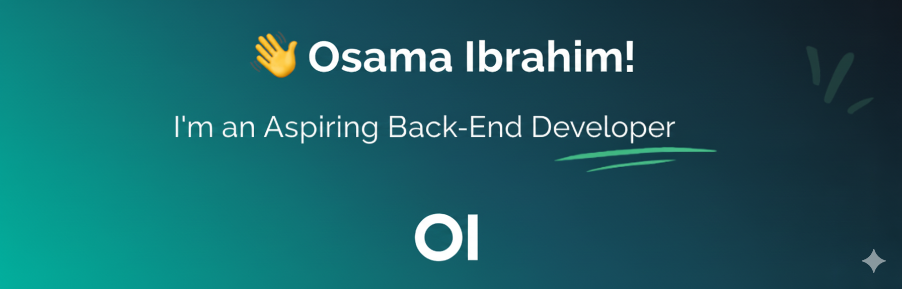

  

  <h1>Osama Ibrahim</h1>
  <h3>Backend Developer (Node.js | TypeScript)</h3>
  
Alexandria, Egypt

  
  
  
   
  <b>Phone:</b> +201010392256

---

## 👨‍💻 Profile
Aspiring Back-End Developer with a strong foundation in **Node.js, Express.js, and TypeScript**. Recently re-engineered a full E-commerce platform, migrating infrastructure from SQL to MongoDB. Proficient in building flexible APIs using GraphQL and real-time features with Socket.io. Committed to writing clean, reliable code using TDD methodologies (Mocha/Chai). Seeking to join an innovative team to leverage skills in scalable system development.

---

## 🛠 Technical Skills
* **Languages & Backend:** JavaScript (ES6+), TypeScript, Node.js, Express.js, GraphQL, WebSockets (Socket.io), RESTful APIs.
* **Databases:** MongoDB (Mongoose), SQL (Sequelize).
* **Testing:** Unit Testing, Mocha, Chai, Sinon (Mocking).
* **Tools & Security:** Git / GitHub, Docker, JWT & Auth, Postman.

---

## 🚀 Key Projects

### 🛒 Advanced E-Commerce API (Node.js & MongoDB)
* Successfully migrated backend infrastructure from SQL to MongoDB/Mongoose, designing complex schemas for Users, Products, and Orders.
* Engineered a robust testing suite using Mocha, Chai, and Sinon, implementing Unit Tests for auth flows and mocking database operations.
* Built a secure authentication system with Session-based Auth, CSRF protection, and input validation.
* Implemented Server-side Pagination and utilized File Streams for efficient PDF invoice generation.

### 🌐 Social Network API (GraphQL & Socket.io)
* Designed a flexible GraphQL API to replace traditional REST endpoints, eliminating over-fetching issues and improving data retrieval efficiency.
* Implemented Real-time communication using Socket.io (WebSockets), allowing users to receive instant post updates and notifications.
* Developed secure image handling features for user posts using Multer.
* Secured the API with JWT authentication and advanced validation logic.

---

## 💼 Professional Skills
* Structured Problem Solving (McKinsey Framework).
* Agile & Human-Centered Design (HCD).
* Critical Thinking, Time Management, & Effective Communication.

---

## 🎓 Education
**Bachelor of Computer Science**
*Higher Institute for Management and Information Technology, Kafr El-Sheikh*
* **Dates:** October 2021 - June 2025
* **Grade:** Good

---

## 📜 Certificates
**NodeJS - The Complete Guide (MVC, REST APIs, GraphQL)** - *Udemy (Academind)*
> December 2025 - Comprehensive 40.5-hour bootcamp covering Node.js ecosystem, SQL (Sequelize), NoSQL (MongoDB), and TDD.

**ALX Professional Foundations** - *ALX*
> October 2024 - Focused on Meta-Skills, Data-Driven Decision Making, and soft skills.

---

## 🗣 Languages
* **Arabic:** Native
* **English:** Conversational

---

## 📊 GitHub Stats

  
   
  

